# akm improve — Workflow Reference

`akm improve` is the scheduled self-improvement loop that walks every asset in the bundle (or a scoped subset), invokes the reflection agent and the LLM distiller on each one, runs memory consolidation across the corpus, and then performs improve-owned maintenance passes such as memory inference and graph extraction. It is the primary mechanism for turning accumulated feedback signals into queued proposals. Proposals remain queued until explicit proposal review or the configured drain policy resolves them; events and resolved proposal rows provide the audit trail.

## Command surface

| Option | Type | Purpose |
|---|---|---|
| `--scope` | `string` | Restrict the run to a single ref (`[bundle//]conceptId`), an asset type (`lesson`), or omit for all assets. |
| `--task` | `string` | Hint forwarded verbatim to the reflection prompt and agent. |
| `--dry-run` | `boolean` | Compute the plan from the existing index and analyze memory cleanup; emit no events, acquire no lock, call no model, and write nothing. |
| `--target` | `string` | Passed through to `akmConsolidate` as the write-target source override. |
| `--limit` | `number` | Cap the number of assets processed after utility-score sorting. |
| `--timeout-ms` | `number` | Wall-clock budget for the entire run. Default: 7 200 000 ms (2 hours). |
| `--skip-if-locked` | `boolean` | If another improve owns the whole-run lock, return an exit-0 no-op result before triage, indexing, events, or sync. Without the flag, contention is a config error. |
| `--require-feedback-signal` | `boolean` | Restrict all/type runs to refs with recent feedback signals; disable retrieval fallback. |

Injected function seams (`reflectFn`, `distillFn`, `ensureIndexFn`, `reindexFn`) replace production defaults in tests.

## High-level flow

```mermaid
flowchart TD
    A([akm improve invoked]) --> B[resolveImproveScope\nscope mode: all / type / ref]
    B --> C{dryRun?}
    C -- no --> E[Acquire whole-run lock\n$STATE/locks/&lt;stash&gt;/improve.lock]
    C -- yes --> COLLECT[collectEligibleRefs\nquery existing SQLite index, filter to stashDir]
    E --> E1{lock file or maintenance barrier held?}
    E1 -- yes, skip-if-locked --> SKIP[Return exit-0 no-op\nno triage, index, events, or sync]
    E1 -- yes, no flag --> ERR([throw ConfigError: already running])
    E1 -- no / stale reclaimed --> TRIAGE[Triage pending proposal backlog]
    TRIAGE --> ENSURE[ensureIndex primaryStashDir\nshared deadline signal]
    ENSURE --> COLLECT
    COLLECT --> CLEANUP_ANALYZE{memoryCleanup eligible?}
    CLEANUP_ANALYZE -- yes --> ANALYZE[analyzeMemoryCleanup\nscans .derived memories\nPRE-COMPUTED before dryRun check]
    CLEANUP_ANALYZE -- no --> D
    ANALYZE --> D{dryRun?}
    D -- yes --> DRY[Return dry-run result\nno lock, no events, no writes, no model calls\nincludes memoryCleanupPlan analysis]
    D -- no --> CONSOLIDATE
    J[applyMemoryCleanup\npersist belief-state transitions\narchive prune candidates to .akm/memory-cleanup/archive/]
    J --> K[filterRemovedPlannedRefs\ndrop archived refs from queue]

    K --> L[Signal filter\nkeep only refs with recent feedback events\nhaving metadata.signal or metadata.note]
    L --> L2[Zero-feedback fallback\ninclude refs with retrievalCount >= threshold\ndefault threshold: 5]
    L2 --> M[buildUtilityMap\nlook up utility scores from SQLite]
    M --> N[Sort by utility score DESC\napply --limit if set]
    N --> J2{anything archived or transitioned?}
    J2 -- yes --> J3[push memory-prune actions\nreindexFn: rebuild SQLite index]
    J2 -- no --> O
    J3 --> O[Pre-run validation sweep\ncheck file exists + lesson description]
    O --> P{validationFailures?}
    P -- yes --> P1[Log failures; add to validationFailures set\ncontinue with valid refs only]
    P -- no --> Q

    P1 --> Q

    subgraph ASSET_LOOP["Per-asset loop"]
        Q --> S{ref in validationFailures?}
        S -- yes --> SKIP([skip, next asset])
        S -- no --> R{budget exhausted?}
        R -- yes --> BUDGET([push error action\nbreak loop])
        R -- no --> REFLECT

        subgraph REFLECT["reflectFn subprocess"]
            REFLECT_A[appendEvent: reflect_invoked] --> REFLECT_B[lookup ref in FTS index\nread asset file content]
            REFLECT_B --> REFLECT_C[readRecentFeedback\nbuildSchemaHints for lessons]
            REFLECT_C --> REFLECT_D[buildReflectPrompt]
            REFLECT_D --> REFLECT_E{RunnerSpec kind?}
            REFLECT_E -- sdk --> REFLECT_SDK[executeRunner\nin-process SDK call]
            REFLECT_E -- spawn --> REFLECT_SPAWN[executeRunner\nspawn agent CLI binary\ncaptured stdout]
            REFLECT_SDK --> REFLECT_F
            REFLECT_SPAWN --> REFLECT_F[parseAgentProposalPayload\nextract JSON from stdout]
            REFLECT_F --> REFLECT_G[createProposal\nstate.db proposals row\nsource: reflect]
            REFLECT_G --> REFLECT_H([return AkmReflectResult\nok or failure envelope])
        end

        REFLECT_H --> T{lesson or distillable memory?}
        T -- no --> NEXT_ASSET
        T -- yes + memory without recent feedback
        --> SKIP_WEAK[push distill-skipped action\nappendEvent improve_skipped\nreason: memory_distill_requires_feedback]
        T -- yes --> DEDUP{pending proposal\nalready exists for lessonRef?}
        DEDUP -- yes --> SKIP_DISTILL[push distill-skipped action]
        DEDUP -- no --> DISTILL

        subgraph DISTILL["distillFn subprocess"]
            DISTILL_A[lookup ref file path] --> DISTILL_B[readEvents: feedback for ref\napply excludeFeedbackFromRefs filter]
            DISTILL_B --> DISTILL_C{proposalKind == auto\nAND promotion heuristic passes?}
            DISTILL_C -- yes --> DISTILL_PROMOTE[createProposal knowledge/ref\nsource: distill\nappendEvent: distill_invoked outcome=queued]
            DISTILL_C -- no --> DISTILL_D[tryLlmFeature: feedback_distillation\n30 s hard timeout\nnull on gate-disabled or error]
            DISTILL_D --> DISTILL_E{raw == null?}
            DISTILL_E -- yes --> DISTILL_SKIP[appendEvent: distill_invoked outcome=skipped\nreturn skipped result]
            DISTILL_E -- no --> DISTILL_F[stripMarkdownFences\nlintLessonContent or validateKnowledgeContent]
            DISTILL_F --> DISTILL_G{findings?}
            DISTILL_G -- yes --> DISTILL_FAIL[appendEvent: outcome=validation_failed\nthrow UsageError]
            DISTILL_G -- no --> DISTILL_H[createProposal lessons/slug-lesson\nor knowledge/slug\nsource: distill\nappendEvent: outcome=queued]
            DISTILL_PROMOTE --> DISTILL_RETURN
            DISTILL_SKIP --> DISTILL_RETURN
            DISTILL_H --> DISTILL_RETURN([return AkmDistillResult])
        end

        SKIP_DISTILL --> NEXT_ASSET
        SKIP_WEAK --> NEXT_ASSET
        DISTILL_RETURN --> NEXT_ASSET([completedCount++\nlog progress])
    end

    NEXT_ASSET --> S

    BUDGET --> MAINT
    SKIP --> S
    NEXT_ASSET -->|all assets done| MAINT

    subgraph CONSOLIDATE_SUB["akmConsolidate subprocess"]
        CON_A{selected strategy processes.consolidate.enabled?} -- no --> CON_NOOP([return empty result])
        CON_A -- yes --> CON_C[loadMemoriesForSource\nSQLite DB\nexclude .derived names]
        CON_C --> CON_D{memories == 0?} -- yes --> CON_NOOP
        CON_D -- no --> CON_E

        subgraph PHASE_A["Phase A — Plan generation (chunked)"]
            CON_E[split into configured chunks] --> CON_F[For each chunk:\nchatCompletion with frozen consolidate connection]
            CON_F --> CON_G[parse and validate ops:\nmerge / delete / promote / contradict]
            CON_G --> CON_H{2+ consecutive failures?} -- yes --> CON_ABORT[push warning, break]
            CON_H -- no --> CON_F
        end

        CON_ABORT --> CON_MERGE
        CON_G --> CON_MERGE[mergePlans: deduplicate ops\nmerge wins over delete]
        CON_MERGE --> CON_DRY{dryRun?} -- yes --> CON_DRYRESULT([return planned ops, no writes])
        CON_DRY -- no --> PHASE_B

        subgraph PHASE_B["Phase B — Advisory result and proposal emission"]
            PHASE_B_A[Keep merge / delete / contradict\nas advisory planned operations]
            PHASE_B_A --> PHASE_B_PRO[For each promote op:\nidempotency check and emitProposal\nsource: consolidate]
        end

        PHASE_B_PRO --> CON_DONE[return ConsolidateResult]
    end

    CONSOLIDATE --> CON_A
    CON_NOOP --> J
    CON_DONE --> J
    CON_DRYRESULT --> J
    CON_ABORT2 --> MAINT

    subgraph MAINTENANCE["Improve-owned maintenance"]
        MAINT[runImproveMaintenancePasses] --> MI{memory refs queued for inference?}
        MI -- no --> GRAPH
        MI -- yes --> MI_RUN[runMemoryInferencePass]
        MI_RUN --> MI_WRITE{wrote derived memories\nor marked parents?}
        MI_WRITE -- yes --> MI_REINDEX[reindexFn\nrefresh SQLite state after inference writes]
        MI_WRITE -- no --> GRAPH
        MI_REINDEX --> GRAPH[runGraphExtractionPass\nafter consolidation and inference settle]
    end

    GRAPH --> FINAL

    FINAL[Assemble AkmImproveResult\nschemaVersion: 2 and sync stash] --> UNLOCK[release whole-run lock\nfinally block]
    UNLOCK --> RETURN([return AkmImproveResult])
```



## Subprocess detail

### reflect (akmReflect)

`akmReflect` is the agent-invocation subprocess. It always emits a `reflect_invoked` event at entry, regardless of success or failure.

For `skills/*` refs, reflect also reviews related distilled lessons as consolidation evidence. When those lessons show strong, repeatable, factual guidance, the agent may propose promoting that guidance into long-term skill documentation, including companion reference docs under `skills/<skill>/references/*.md` via `knowledge/skills/<skill>/references/<topic>` refs.

**Internal steps:**

1. Emit `reflect_invoked` event via `appendEvent`.
2. Resolve asset content: look up the ref in the FTS index; read the file if found. Index miss is non-fatal.
3. Resolve the selected strategy's `reflect.engine`, falling back to `defaults.llmEngine`.
4. For skill refs, load the canonical derived lesson (`lessons/<type>-<name>-lesson`) plus any lesson files whose frontmatter `sources` cite the skill ref.
5. Build the reflection prompt via `buildReflectPrompt` (see Prompt shape below).
6. Dispatch the frozen `RunnerSpec` through `executeRunner`. Unattended improve
   requires an LLM engine; explicit interactive uses may select an agent engine.
7. Parse stdout: `parseAgentProposalPayload` strips `<think>` blocks and code fences, then JSON-parses the output. Falls back to raw markdown detection if JSON parse fails.
8. Write the proposal: `createProposal(stash, { ref, source: "reflect", payload: { content, frontmatter } })`.

**What it writes:** one durable proposal row in `state.db`. It never writes asset files directly.

**Prompt shape (`buildReflectPrompt`):** The prompt instructs the agent to review the current asset content plus recent feedback signals and return a single JSON object `{ ref, content, frontmatter? }`. When `feedback` is empty and a ref is set, the prompt normally constrains the agent to schema/structural improvements only. The exception is `skills/*` refs with related distilled lessons: in that case the prompt allows substantive changes justified by those lessons and explicitly asks whether durable guidance should stay in `SKILL.md` or be promoted into a companion `knowledge/skills/<skill>/references/<topic>` doc. Lesson refs get a distinct goal framing ("distill what usage signals reveal") versus non-lesson refs ("produce an improved version"). The response contract (`RESPONSE_CONTRACT_JSON`) requires the agent to produce only the JSON object — no prose before or after. Non-empty feedback is always preceded by a caveat (`reflect-feedback-framing.md`) framing it as an unverified signal to investigate, not a fact to insert — feedback claims a model treated as ground truth were fabricating whole sections asserting details the asset never contained (#952).

**Asset content cap:** the asset content section is capped to keep the prompt well under OS ARG_MAX when it travels through CLI argv (agent/SDK runners always use the flat `REFLECT_CONTENT_CAP`, 12 000 chars). The direct-LLM (`kind: "llm"`) path never touches argv, so its cap is instead computed from the resolved engine's `contextLength` (chars-per-token estimate × the reserve actually used by the rest of that prompt, measured per call rather than guessed), halved to reserve the other half of the usable context window for the model's response — a reflect rewrite returns a body roughly the size of the input, so the request must leave room to receive one — and never dropping below the flat floor. When content is truncated, a `REFLECT_TRUNCATION_MARKER` notice is appended; the output contracts explicitly forbid echoing that marker back, and `sanitizeReflectPayload` still detects a leaked marker in the response and defers the proposal for review (`reflect-truncation-leak`) rather than queuing it silently (#952).

### distill (akmDistill)

`akmDistill` is the bounded in-tree LLM subprocess. It never calls `runAgent`; it issues a direct HTTP chat completion through the configured LLM endpoint. It always emits exactly one `distill_invoked` event.

**Internal steps:**

1. Validate the input ref shape (`parseRefInput`, `src/core/asset/resolve-ref.ts`).
2. Best-effort load asset content via `lookupFn` (defaults to indexer `lookup`).
3. Read feedback events via `readEvents({ ref, type: "feedback" })`. Apply `excludeFeedbackFromRefs` filtering before the LLM sees the events.
4. Memory promotion fast path: when `proposalKind` is `"auto"` or `"knowledge"` and `assessMemoryKnowledgePromotionCandidate` returns `promote: true`, create a `knowledge:` proposal immediately without an LLM call.
5. Resolve `improve.strategies.<selected>.processes.distill.engine` (falling
   back to `defaults.llmEngine`), then issue one bounded call.
   - Process gate: disabled if the selected strategy's `processes.distill.enabled` is `false`.
   - Hard timeout: 600 seconds by default, overridden by the resolved invocation timeout.
   - Returns `null` on gate-disabled, timeout, or error — treated as a graceful skip (exit 0, no proposal).
6. Strip markdown fences and `<think>` blocks from the raw LLM output.
7. Validate: `lintLessonContent` for lesson proposals; `validateKnowledgeContent` for knowledge proposals. Failure emits `distill_invoked` with `outcome: "validation_failed"` and throws `UsageError`.
8. Create proposal: `createProposal(stash, { ref: lessonRef, source: "distill", payload })`.
9. Emit `distill_invoked` event with `outcome: "queued"`.

**Lesson-ref derivation rule:** `lessons/<type>-<name>-lesson` where `<type>-<name>` is derived from the input ref with origin stripped and non-alphanumeric characters replaced by `-`. Example: `skills/deploy` → `lessons/skill-deploy-lesson`.

**What it writes:** one durable proposal row in `state.db`. Never writes asset files directly.

### consolidate (akmConsolidate)

`akmConsolidate` runs during preparation, before session extraction and the
per-asset loop.

**Gate:** returns immediately (no-op result) if the selected strategy's
`processes.consolidate.enabled` is false.

**Phase A — Plan generation:**

1. Load eligible non-`.derived` memory assets from the SQLite index.
2. Chunk memories using the selected strategy's configured limit. For each
   chunk, call `chatCompletion` with the frozen consolidate LLM connection and
   `CONSOLIDATE_SYSTEM_PROMPT`, requesting a JSON plan of `merge` / `delete` /
   `promote` / `contradict` operations.
3. Parse and validate each op, then use `mergePlans` to deduplicate conflicts
   across chunks.

**Phase B — Advisory result and proposal emission:**

1. Return merge, delete, and contradict operations as advisory planned work;
   consolidation does not mutate memory assets.
2. For each promote op, perform idempotency checks and emit a reviewable
   proposal with `source: "consolidate"`.
3. Advance the consolidation watermark only when every chunk completed, no
   advisory operation remains unapplied, and every promotion proposal was
   emitted or deterministically deduplicated.

**What it writes:**
- A durable row in the `proposals` table in `state.db` for each emitted
  `promote` op, partitioned by bundle path.

### improve-owned maintenance

After consolidation completes, `akmImprove` runs maintenance steps that own the
remaining live-write memory/index artifacts previously coupled to indexing.

**Memory inference:**

1. Collect the memory refs that completed distill without being promoted to
   `knowledge:` in the same improve run.
2. Call `runMemoryInferencePass` with those refs.
3. If the pass writes derived memories or marks parents with
   `inferenceProcessed: true`, call `reindexFn({ stashDir })` so SQLite/search
   state reflects the new disk state before any later steps run.

**Graph extraction:**

1. Run `runGraphExtractionPass` only after consolidation and any inference
   reindex are complete.
2. Refresh the graph rows in `index.db` against the final post-improve disk
   state so search-time graph boosts do not immediately go stale.
3. Internal partial refresh paths preserve unrelated graph rows rather than
   rebuilding the indexed graph state from only the touched subset.

### Proposal queue

`createProposal` is the single write point used by reflect, distill, and consolidate (promote). It writes the canonical `proposals` table in `state.db`; rows are partitioned by `stash_dir`, and pending/accepted/rejected/reverted are statuses on the same durable record. The retired `<stash>/.akm/proposals/` tree is neither read nor written.

**Logical proposal shape:**

```json
{
  "id": "<UUID>",
  "ref": "lessons/skill-deploy-lesson",
  "status": "pending",
  "source": "reflect",
  "sourceRun": "reflect-1715000000000",
  "createdAt": "2026-05-11T00:00:00.000Z",
  "updatedAt": "2026-05-11T00:00:00.000Z",
  "payload": {
    "content": "---\ndescription: ...\n---\n\nbody",
    "frontmatter": { "description": "..." }
  }
}
```

Two proposals can share the same `ref`; their UUID primary keys prevent collisions. The dedup guard in `akmImprove` (checking `listProposals(stashDir, { ref: lessonRef })`) skips `akmDistill` when a pending proposal already exists for the derived lesson ref.

## Scope restrictions

`akm improve` and `akm lint` only operate on writable bundle sources (sources with `writable: true`). Read-only sources (git, npm, website) are excluded from the candidate set before any other filtering.

## Cooldown pre-filter

Before the per-asset loop, `akm improve` builds Sets of all refs that are currently under cooldown (reflect, distill, consolidation, schema-repair) in a single batch of event reads. This replaces the prior design that issued one `readEvents` query per ref inside the loop. The change eliminates the "reflect cooldown" console spam on large bundles and reduces database round-trips to O(1) reads per cooldown category. Reflect cooldown now bypasses refs with a newer `promoted` event than their last `reflect_invoked` event.

## Strategy process configuration

| Process | Config path | Controls |
|---|---|---|
| `distill` | `improve.strategies.<name>.processes.distill` | Enables distillation and selects its LLM engine/model/request overrides. |
| `consolidate` | `improve.strategies.<name>.processes.consolidate` | Enables consolidation and selects its LLM engine/model/request overrides. |

Improve process selection is resolved once by `resolveImprovePlan`; the plan
contains every process's frozen enablement, process config, and resolved runner.
LLM-only processes reject an explicit agent engine rather than falling through.

## Output shape

`AkmImproveResult` uses `schemaVersion: 2`, identifies the selected `strategy`,
and can report `ok: false` for terminated runs:

| Field | Type | Description |
|---|---|---|
| `scope` | `{ mode, value? }` | Resolved scope (`all`, `type`, or `ref`). |
| `dryRun` | `boolean` | Whether this was a dry run. |
| `guidance` | `string?` | Human-readable note about memory cleanup when memories are in scope. |
| `memorySummary` | `{ eligible, derived }` | Count of memory assets in scope and count of `.derived` ones. |
| `memoryCleanup` | `ImproveMemoryCleanupResult?` | Analysis (always present when eligible > 0) merged with apply results on a live run. Includes `archived`, `transitionLogPath`, `transitionLogEntries`, and `warnings`. |
| `plannedRefs` | `ImproveEligibleRef[]` | The post-filter, post-cleanup, utility-sorted refs that were (or would be) processed. |
| `actions` | `ImproveActionResult[]?` | Per-asset action record: mode (`reflect`, `distill`, `distill-skipped`, `memory-prune`, `memory-inference`, `graph-extraction`, `error`) and the subprocess result. Absent on dry-run. |
| `validationFailures` | `Array<{ ref, reason }>?` | Refs skipped due to pre-run validation failures (missing file, missing description). |
| `consolidation` | `ConsolidateResult?` | Result from `akmConsolidate`; omitted when `processed === 0` and no warnings. |
| `memoryInference` | `MemoryInferenceResult?` | Improve-owned post-consolidation memory inference telemetry. |
| `graphExtraction` | `GraphExtractionResult?` | Improve-owned post-consolidation graph refresh telemetry: considered/extracted counts, entity/relation totals, quality summary, latest-run graph telemetry (`extractorId`, `extractionRunId`, model, prompt version, batch size, cache hits/misses, truncation count, failure count), and any low-quality warnings. |

## Consolidation Skip Reason Taxonomy

`akmConsolidate` emits structured `skipReasons` entries in its result. Each entry is `{ op, ref, reason }`. The reasons fall into three categories:

### Expected / healthy (not bugs)

| Reason | Meaning |
|--------|---------|
| `merge_participant_blocked` | Hot or unparseable memory was a merge participant. Pre-flight guard fires before LLM call. High counts are normal on bundles with many `captureMode: hot` memories. |
| `captureMode_hot_refused` | Delete refused on a hot memory. Correct behavior. |
| `promote_already_exists` | Target knowledge ref already exists on disk. Normal steady-state noise. |
| `promote_source_too_small` | Source body too short to warrant a promotion proposal. |
| `merge_content_too_short` | Secondary body too short to be a meaningful merge candidate. |
| `dedup_pending_proposal` | Ref already has a pending proposal. Clears as triage drains the queue. |

### Fixed bugs — should be 0 in steady state

| Reason | Root cause | Fix | Regression signal |
|--------|-----------|-----|-------------------|
| `merge_missing_description` | Guard ordering bug: pre-flight hot guard was placed *after* `generateMergedContent()`, so hot memories wasted LLM calls and then failed the description check. | Commit `208fe06`: pre-flight guard before LLM call. | Any non-zero count. |
| `merge_primary_missing` (stale-DB path) | Prior run deleted files but did not reindex; ghost DB entries reached chunk prompts. | Commit `d34bc1a`: pre-flight `fs.existsSync` filter before chunking. | Log line `Pre-flight: filtered N stale DB entries` + `merge_primary_missing` in same run. |
| `merge_primary_missing` (hallucination path) | LLM invented a primary ref not in the loaded pool; `mergePlans()` had no ref-existence check; every real secondary charged with `merge_primary_missing`. | Commit `a853de4`: `mergePlans()` accepts `knownRefs` set; ops with hallucinated primaries dropped pre-execution. | Log line `mergePlans: primary <ref> not in loaded memory pool (LLM hallucination)`. |

### Residual / low-frequency (not bugs at normal rates)

| Reason | Meaning | Normal rate | Investigation threshold |
|--------|---------|-------------|------------------------|
| `merge_primary_missing` (intra-run race) | An earlier op consumed the ref as a secondary; Fix-A (`memoryByRef.delete`) pruned it; a later op's plan used that ref as its primary. Log: `Merge: primary <ref> not found in loaded memories (pruned by prior op this run)`. | 0–2/run | >2/run: investigate chunk plan ordering |
| `merge_primary_file_gone` | Defense-in-depth: file existed at pre-flight but was deleted between pre-flight and Phase B execution. | 0–1/run | >1/run: investigate lock contention |

### Distinguishing `merge_primary_missing` causes at a glance

```
merge_primary_missing spike → check log for:
  "Pre-flight: filtered N stale DB entries"  → stale-DB regression (d34bc1a broken)
  "pruned by prior op this run"              → intra-run race (normal if ≤2)
  "LLM hallucination" (in mergePlans warn)   → hallucination caught, not charged (a853de4 working)
  "merge_primary_file_gone" in skip reasons  → concurrent file deletion
  none of the above + code change            → investigate pre-flight filter / memoryByRef init
```

## Reviewed

Reviewed against `src/commands/improve/improve.ts`,
`src/commands/improve/reflect.ts`, and `src/commands/improve/distill.ts`.

**Checked:**
- Diagram branch ordering for lock vs. scope resolution
- Diagram branch ordering for dry-run early-return
- Validation sweep placement relative to the limit filter
- Consolidation placement relative to the per-asset loop
- Maintenance placement relative to consolidation and reindex
- Per-asset loop branch ordering (validation skip vs. budget check)
- Memory cleanup step sequencing (analyzeMemoryCleanup, applyMemoryCleanup, reindexFn)
- Strategy gating for consolidation (`improve.strategies.<name>.processes.consolidate.enabled`)
- Dry-run early-return node completeness
- Budget-exhausted break path
- Mermaid syntax and subgraph labels

**Fixed:**

1. **`analyzeMemoryCleanup` placement (critical accuracy bug):** The original diagram showed `analyzeMemoryCleanup` happening after lock acquisition (`E3 → F → G → H{memoryCleanup eligible?} → I`). In the actual code (`improve.ts` lines 251–253), `memoryCleanupPlan` is computed unconditionally before the `dryRun` check (line 259) and before lock acquisition (line 272). Moved `analyzeMemoryCleanup` to before the `dryRun?` diamond, and updated the DRY node to note it includes the pre-computed analysis.

2. **Per-asset loop branch order (critical accuracy bug):** The original diagram checked `R{budget exhausted?}` before `S{ref in validationFailures?}`. In the code (lines 394–407), the validation skip (`validationFailureRefs.has(planned.ref)`) is evaluated first (`continue` on line 395), and the budget check happens second (line 396). Swapped the order so `S{ref in validationFailures?}` is the first branch in the loop, followed by `R{budget exhausted?}`. Updated all loop-back edges accordingly.

3. **`reindexFn` timing (accuracy bug):** The original diagram placed `J3[reindexFn]` before `K[filterRemovedPlannedRefs]`. In the code, `filterRemovedPlannedRefs` (line 336) and the signal filter/sort/limit steps (lines 338–349) all run before the reindex block (lines 351–368). Moved `reindexFn` and `push memory-prune actions` to after the sort/limit step and before the validation sweep, matching the actual code order.

4. **Post-loop maintenance placement (accuracy bug):** Improve now runs memory inference and graph extraction after consolidation, not before it. The workflow now documents the maintenance stage and the reindex after inference writes.
